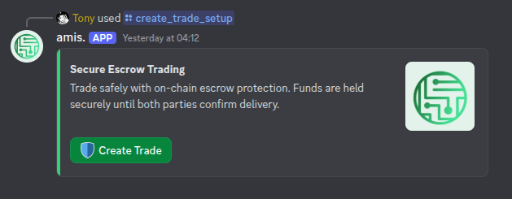
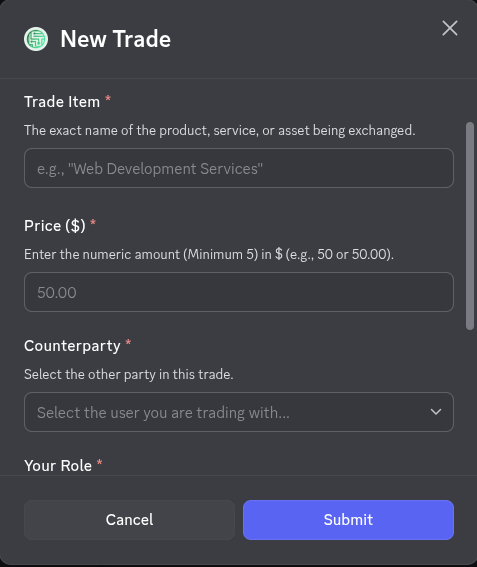
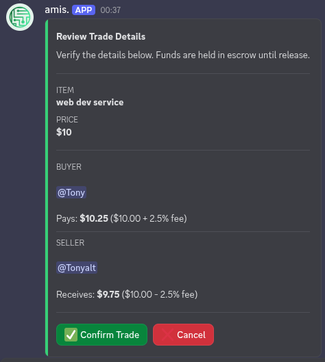
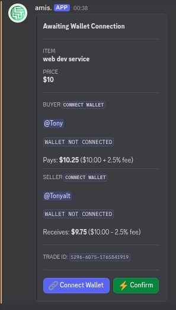
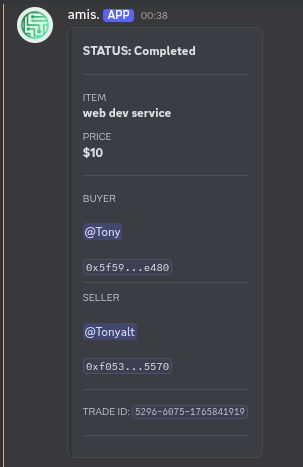

# amis. - Secure Decentralized Escrow

[](https://discord.gg/nRFU9rFVa)

Facilitating secure, transparent, and decentralized escrow for diverse peer-to-peer exchanges.

---

## Overview

The `amis.` project aims to provide a robust framework for **secure, trustless, and decentralized escrow services**, extending beyond just digital asset trades to encompass **various goods, services, and jobs**. Primarily accessed via a Discord bot and a complementary web frontend, `amis.` empowers users to engage in diverse peer-to-peer exchanges with confidence. This specific repository showcases the foundational **Solidity smart contracts** that power the escrow functionality. While the full `amis.` solution includes proprietary backend bot logic and a sophisticated frontend application, these open-source contracts represent the transparent and auditable core that governs all escrowed transactions.

## High-Level Architecture

The `amis.` ecosystem comprises three main components:

1.  **Frontend:** A web application for users to interact with the escrow system, manage trades, and connect their wallets. This component is kept private to protect proprietary UI/UX designs and integrations. It showcases the user experience and interaction with the underlying smart contracts.
2.  **Backend:** A Discord bot and its associated backend services that handle user commands, orchestrate trade setups, manage Discord-specific interactions, and communicate with the smart contracts on behalf of users. This component is also private for intellectual property and security considerations.
3.  **Smart Contracts:** The Solidity smart contracts deployed on the blockchain that manage the escrow logic, USDC token transfers, and trade state. These contracts are fully open-source and auditable, forming the trust layer of the `amis.` protocol.

The Frontend and Backend interact with these Smart Contracts to create, fund, and release escrowed assets, ensuring transparency and immutability for all trade participants.

## Technologies Used

- **Smart Contracts (in this repo):**
  - **Solidity:** For writing secure and efficient smart contracts.
  - **Foundry:** A blazing fast, portable and modular toolkit for Ethereum application development written in Rust.
- **Frontend (not in this repo):**
  - **React, Vite, Tailwind CSS:** Modern web development stack for a responsive and intuitive user interface.
  - **Shadcn UI:** Reusable UI components for a polished design.
  - **Wagmi, Reown AppKit:** Libraries for seamless blockchain interaction and wallet integration.
- **Backend Bot (not in this repo):**
  - **Node.js:** Runtime environment for the bot and backend services.
  - **Supabase:** For database management and backend services.

## Smart Contract Details

This repository focuses on the `AmisEscrowUSDC.sol` smart contract, the core component responsible for facilitating secure escrow. Its key responsibilities include:

- **Escrow Creation:** Allowing a buyer to create an escrow for a specific transaction amount.
- **USDC Handling:** Managing the secure deposit and conditional release of USDC tokens.
- **Fee Management:** Automatically converting collected USDC fees into Native ETH via Uniswap V3 (Base network) to sustain gas operations.
- **Trade State Management:** Tracking the status of each escrowed transaction (e.g., funded, released, disputed).
- **Security:** Ensuring that funds are released only under predefined, verifiable conditions, typically through automated processes coordinated by the backend bot or agreed-upon multi-signature approvals.

The contract is designed to be deployed on the Base network, with particular focus on the Base Sepolia testnet for development and testing.

## Getting Started (Smart Contract)

To compile and deploy the smart contract locally using Foundry:

1.  **Clone this repository:**
    ```bash
    git clone https://github.com/tonyrav3n/amis-bot-live.git
    cd amis-bot-live
    ```
2.  **Install Foundry:**
    If you haven't installed Foundry yet, run:
    ```bash
    curl -L https://foundry.paradigm.xyz | bash
    foundryup
    ```
3.  **Install Dependencies:**
    ```bash
    forge install
    ```
4.  **Compile the contract:**
    ```bash
    forge build
    ```
5.  **Run tests:**
    ```bash
    forge test
    ```

## Screenshots






